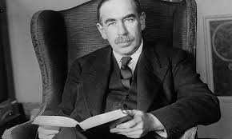
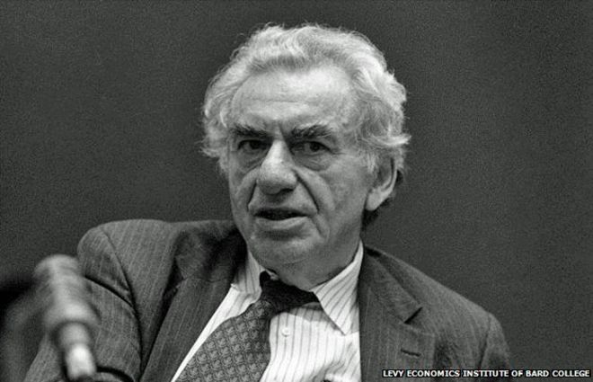
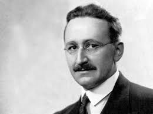

# Oversikt over faget

## Tre hovedtemaer: 
- Konjunktursvingninger - del I
- Økonomisk vekst - del II  
- Økonomiske kriser - del III 


```{r include=FALSE}
library(MakroOEKB1115)
library(dplyr)
library(ggplot2)
library(gridExtra)
library(grid)

# Henter datasett
moltmacrousa <- MakroOEKB1115::moltmacrousa

varinavng <- c('BNP', 'BNP-trend (hp-filter)')

hpg <- gpmakro(moltmacrousa, variables = c('lngdp', 'hptrendg'), katv = c('gdp'), startp = "1929-04-01", endp =" 2017-12-12", variabeln = varinavng, labt = list(y='BNP realpriser (log)', x = 'År'))
gdg <- gpmakro(moltmacrousa, variables = c('lngdp', 'hptrendg'), katv = c('gdp'), startp = "1929-04-01", endp =" 1941-01-01", variabeln = varinavng, labt = list(y='BNP realpriser (log)', x = 'År'))
grg <- gpmakro(moltmacrousa, variables = c('lngdp', 'hptrendg'), katv = c('gdp'), startp = "2007-01-01", endp =" 2017-12-12", variabeln = varinavng, labt = list(y='BNP realpriser (log)', x = 'År'))
mpg <- gpmakro(moltmacrousa, variables = c('lngdp', 'hptrendg'), katv = c('gdp'), startp = "1945-01-01", endp =" 2017-12-12", variabeln = varinavng,labt = list(y='BNP realpriser (log)', x = 'År'))

varinavnu <- c('Ledighetsrate', 'Snitt (normalperioden)')

hpu <- gpmakro(moltmacrousa, variables = c('unem', 'trendu'), katv = c('unem')
, startp = "1929-04-01", endp =" 2017-12-12", variabeln = varinavnu
,labt = list(y='Ledighetsrate', x = 'År'))
gdu <- gpmakro(moltmacrousa, variables = c('unem', 'trendu'), katv = c('unem')
, startp = "1929-04-01", variabeln = varinavnu
,endp =" 1941-01-01", labt = list(y='Ledighetsrate', x = 'År'))
gru <- gpmakro(moltmacrousa, variables = c('unem', 'trendu'), katv = c('unem')
, startp = "2007-01-01", endp =" 2017-12-12", variabeln = varinavnu
,labt = list(y='Ledighetsrate', x = 'År'))
mpu <- gpmakro(moltmacrousa, variables = c('unem', 'trendu'), katv = c('unem')
,startp = "1945-01-01", endp =" 2007-01-01", variabeln = varinavnu
,labt = list(y='Ledighetsrate', x = 'År'))
```

---

### USA 1929-2016

```{r echo=FALSE, message=FALSE, warning=FALSE, paged.print=FALSE}
grid.arrange(hpg, hpu , ncol = 2, top = 'USA' )
```

---

### USA 1946-2007 

```{r echo=FALSE}
grid.arrange(mpg, mpu , ncol = 2, top = 'USA' )
```

- Sentralt poeng: Makroøkonmien innehar selvkorrigerende mekanismer

---

### USA 1929-1939 ("The Great Depression") og 2007-2012 ("The Great Recession")

```{r echo=FALSE}
grid.arrange(gdg, grg, gdu, gru, top = 'USA' )
```

---

- Sentralt poeng: Makroøkonmien selvkorrigerende egenskaper er satt ut av spill

## Tre grunnleggende spørsmål blir forsøkt besvart

### Hva forårsaker
- konjunktursvingninger?
- økonomisk vekst?
- økonomiske kriser?

## Og hvilken rolle bør offentlige myndigheter spille?
- Stabiliseringspolitikk (aktiv/passiv)
- Vekstpolitikk (kapitalisme/offentlig sektor)
- Økonomiske kriser (stabiliserende/likvidierende)

## Kjente makroøkonomer
<figure>

<figcaption>John M. Keynes (1883-1946)</figcaption>
<figure>
<figure>

<figcaption>Paul Krugman(1953-)</figcaption>

<figcaption>Hyman Minsky (1919-1996)</figcaption>
<figure>
<figure>

<figcaption>Milton Friedman (1912-2006)</figcaption>

<figcaption>Friedrich Hayek (1899-1992)</figcaption>
<figure>

---

### Politikkanbefalinger

```{r pol, child = 'tabeller/polanbefalinger.html'}

```

## Abstraksjon 
[Ockhams barberkniv:](https://no.wikipedia.org/wiki/Ockhams_barberkniv)

> More things should not be used than are necessary (*Entia non sunt multiplicanda praeter necessitatem*)

Dette prinsippet slår fast at man ikke skal anta **flere** foreteelser (i vårt kurs betyr dette *(1) aktører* og *(2) markeder* og *(3) størrelsen på økonomien*) eller ting enn hva som trengs for å forklare de observasjoner som en studerer

---

I dette kurset (1) legger vi Ockhams barberkniv til grunn, samt forsøker vi å beskrive det fenomener vi ønsker å studere ved bruk av (2) matematikk

## Sentrale aktører i makroøkonomien
### Husholdninger (del I, del II og del III)
- Konsumerer og sparer

--

### Bedrifter (del I, del II og del III)
- Produserer og investerer

### Finansinstitusjoner (investerings- og forretningsbanker) (del III) 
- Mellomledd mellom långive og låntakere
- Kredittskapende evner $\Rightarrow$ bestemmer lånetilbudet i økonomien 
<!--
(dvs. tilby lån til kundene ved å øke pengemengden)
The argument that banks originate loans and thereby create money and additional demand was once a commonplace position. But in the 1950s, American Neoclassicals in particular began to push the view that banks are effectively just intermediaries between savers and investors; the view that banks were uniquely important in capitalism became a fringe view. I cover this history and the revival of the endogenous money approach by Basil Moore, Augusto Graziani and others
-->

### Sentralbanken (del I og III)
- Bestemmer rentenivå eller pengemengden

### Regjeringen og stortinget (del I og III) 
- Finanspolitikk

### Markedene vi studerer

### Godemarkedet (varer og tjenester) 
- del I, del II og del III

### Pengemarkedet 
- del I, del III

### Arbeidsmarkedet 
- del I, del III

### Finansmarkeder (kapital- og lånemarkedet) 
- del II, III

### Valutakursmarkedet 
- del I

## Størrelsen på en økonomi

### Lukket (global økonomi) økonomi 
- Påvirkes ikke av omverden (Tilnærming: USA)

### Liten åpen økonomi
- Påvirkes av, men påvirker ikke selv, omverden (Tilnærming:  Norge)
