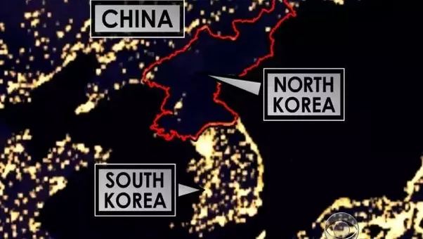

## Introdukson til økonomisk vekst

- Vi er opptatt av økonomisk vekst i et land,  fordi dette øker velstandsnivået blant landets innbyggere over tid

- Det er vanlig å måle et lands velstandsnivå ved å dele BNP $Y$ på antall innbyggere i landet $N$, dvs $Y/N$

- Målinger av dette finnes for de fleste land i verden:  [tabell fra Wikipedia](https://en.wikipedia.org/wiki/List_of_countries_by_GDP_(PPP)_per_capita)

---

### Empiriske observasjoner over tid

- Rike land: Har vokst og BNP per innbygger mellom land har konvergert (dvs. mindre forskjeller).
    + Prediksjonen er i tråd med Solow-modellen for økonomisk vekst
    
- Fattige land: Finner ingen slik klar sammenheng
    + Hypoteser: (1) Geografi, (2) Kultur, **(3) Institusjoner**

<figure>

</figure>

---

###  Inklusive og ekstraktive offentlige institusjoner [@acemoglu2013nations]

Institusjonene kan kalles **ekstraktive** dersom en elite (vanligvis i form av et totalitært regime) benytter disse til å ekstrahere verdier fra flertallet. 

Institusjonene kan kalles **inklusive** dersom de sørger for privat eiendomsrett, borgerrettigheter, upartisk 
rettsvesen, fri etableringsrett og karrierevalg

**Øvelse**: Les artikkelen [Venezuela Is Starving Its People](artikler/del2_venezuela.pdf) og noter ned de eksemplene du finner på ekstraktive institusjoner 

## Solow-modellen for økonomisk vekst 

Solow-modellen har som bakteppe en økonomi med **inklusive** institusjoner. I tillegg kan vi konkretisere følgende forutsetninger: 

-  Lukket økonomi uten offentlig sektor, $Y = C + I$

- Full konkurranse i kapital- og arbeidsmarkedet (innsatsfaktoren avlønnes etter sin grenseproduktivitet)

- Hele befolkningen er sysselsatt (ingen arbeidsledighet), $L=N$

- Produktfunksjonen er homogen av grad én (dobling av innsatsfaktorene fører til dobling av produksjonen)

- Homogen arbeidskraft (alle arbeiderne har like kvalifikasjoner)

- Befolkningen i landet vokser med en konstant rate, $\frac{\dot{N}}{N}=n$

---

### Modellens tre komponenter

1. Produktfunksjonen

$$Y=F(K,AL) \text{ } F_{K}>0, F_{KK}<0, F_{L}>0, F_{LL}<0$$
- Produktfunksjon er homogen av grad én (konstant skalutbytte). Som betyr at en t-dobling av innsatsfaktorene medfører en t-dobling av produksjonen
$$tY=tF(K,L)=F(tK,tL)$$ 

Som betyr at en t-dobling av innsatsfaktorene medfører en t-dobling av produksjonen

- Setter vi $t=\frac{1}{AL}$ får vi $\frac{Y}{AL}=F(\frac{K}{AL},1)$. Definerer vi $y \equiv \frac{1}{AL}$ og $F(K/AL,1) \equiv f(k)$, kan vi skrive produktfunksjone på intensiv form som 

$$y=f(k) \text{ } f'{k}>0, f''{k}<0$$

---

$\text{2.}$ Sparing

$$S=sY=I$$
3. Kapitalakkumalasjon

$$\dot{K}=-\delta K + I$$

---

### Forenklet Solow-modell

- Ingen teknologisk framgang, $A=1$

Starter med å dele $(3)$ på $K$ og setter inn for $I$ fra (2)

$$\frac{\dot{K}}{K} = -\delta  + \frac{sY}{K}=  -\delta  + \frac{sY/N}{K/N}= -\delta  + \frac{sy}{k} $$

Vi har at $\frac{\dot{k}}{k} =\frac{\dot{K}}{K}  - n$ [(lenke her til regneregler)](formler.html), som gjør at vi, 
ved innsetting for $\frac{\dot{K}}{K}$, kan skrive

$$ \frac{\dot{k}}{k} = sf(k)  -(\delta +n) k$$

---

```{r message=FALSE, warning=FALSE, include=FALSE, paged.print=FALSE}
library(dplyr)
library(latex2exp)
library(ggplot2)
library(gridExtra)
library(grid)
library(ggplot2)
library(MakroOEKB1115)
library(dplyr)


solowgrafikk <- Genfigur('solow')
solowgrafikk$numerisk(vartegne=c('sy','y','depk'), par=list(savr=0.5, alpha=0.5, n=0, gamma=0.04), endvar=list(k=1:200) ,kat='solow')
solowgrafikk$optimering(tovectorlabel=c('sy', 'depk'), startv=c(100,10))

#solowgrafikk$optimeringv
ssamlikvedf <- data.frame(x=160 ,y =12.5, xend=160, yend=12.5)
sdftekst <- data.frame(x=c(200 ,200, 200),y=c(15, 8.75, 7.5), kurve=c('f(k)', '(delta+n)*k', 'sf(k)'), farge=c('red', 'red', 'red'))
solowgrafikk$grafisknumappend(samlikve=ssamlikvedf, dftekst=sdftekst, tilstand='solow')

# Skfit
katv <- 'oktsparing'
solowgrafikk$numerisk(vartegne=c('sy','y','depk'), par=list(savr=0.5, alpha=0.5, n=0.01, gamma=0.04), endvar=list(k=1:200) ,kat=katv)
dssamlikvedf <- data.frame(x=103, y=10,1, xend=103, yend=10.1)
dsdftekst <- data.frame(x=c(200 ,200, 200),y=c(15, 10.5, 7.5),kurve=c('f(k)', "(delta+n')*k", "sf(k)"), farge=c('red', 'red', 'red'))
solowgrafikk$grafisknumappend(samlikve=dssamlikvedf, dftekst=dsdftekst, tilstand=katv)
solowgrafikk$ggtyper[[3]]
```

```{r echo=FALSE}
solowgrafikk$grafiskstyle(labs=list(title='Solow-modellen (enkel utgave)', x='k', y='y=f(k)'),
                          skaleringx=list(label=c(TeX('$k^{ss}}$')),breaks=ssamlikvedf$x,limits=NULL),
                          skaleringy=list(label=c(TeX('$y^{ss}}$')),breaks=ssamlikvedf$y,limits=NULL),
                          fargelinje=c('black','black', 'black'),
                          figurnr = 2)
solowgrafikk$ggtyper[[length(solowgrafikk$ggtyper)]]
```

---


#### Modellens sentrale prediksoner
- $sf(k)> (\delta+n) k$ vil *BNP per capita* vokse, og veksten vil være stærkere desto lavere nivået er på $k$ 
- $sf(k)< (\delta+n) k$ vil *BNP per capita* synke, og reduksjonen vil være stærkere desto lavere nivået er på $k$   
- På lang sikt og uavhengig av startverdiren for $k_{0}$, vil økonomien konvergere mot en stasjonær-tilstand (steady-state) hvor
produksjonen per innbygger er konstant, c.
    - Dette medfører at trendveksten (som har benyttet i konjunkturanalysen i del I) i stasjonærtilstanden er gitt ved: 
    $$\frac{Y}{N}=c \Rightarrow ln(Y) - ln(N) = ln(c) \Rightarrow \dot{Y}/Y= n$$

---

Disse resultatene er overens med hva som ble beskrevet innledningsvis: BNP per innbygger har vokst og konvergert (dvs. mindre forskjeller) mellom land med
inklusive institusjoner.

---

#### Skiftanalyse

- Økt befolkningsvekst (pga. økt fødselsrate og/eller nettoinvandring)

```{r echo=FALSE}
solowgrafikk$grafiskstyle(labs=list(title='Solow-modellen (enkel utgave)', x='k', y='y=f(k)'),
                          skaleringx=list(label=c(TeX("$k^{ss}}$"),TeX("$k^{ss'}}$")), breaks=c(dssamlikvedf$x, ssamlikvedf$x),limits=NULL),
                          skaleringy=list(label=c(TeX("$y^{ss}}$"),TeX("$y^{ss'}}$")), breaks=c(dssamlikvedf$y, ssamlikvedf$y),limits=NULL),
                          fargelinje=c('black','black', 'black'),
                          figurnr = 3)

solowgrafikk$ggtyper[[length(solowgrafikk$ggtyper)]]
```


---

### Solow-modellen (normalversjonen)


```{r include=FALSE}
### Vanlig Solow-modell
nsolowgrafikk <- Genfigur('solow')

nsolowgrafikk$numerisk(vartegne=c('sy','y','depk'), par=list(savr=0.4, alpha=0.5, n=0.01, gamma=0.04), endvar=list(k=1:200) ,kat='solow')
#nsolowgrafikk$optimering(tovectorlabel=c('sy', 'depk'), startv=c(100,10))

#nsolowgrafikk$optimeringv
ssamlikvedf <- data.frame(x=65, y=8, xend=65, yend=8)
sdftekst <- data.frame(x=c(200 ,190, 200),y=c(15, 11, 6), kurve=c('f(k)', "(a+n+delta)k", 'sf(k)'), farge=c('red', 'red', 'red'))
nsolowgrafikk$grafisknumappend(samlikve=ssamlikvedf, dftekst=sdftekst, tilstand='solow')
nsolowgrafikk$ggtyper[[2]]

# Skfit
nkatv <- 'oktbefolkning'

nsolowgrafikk$numerisk(vartegne=c('sy','y','depk'), par=list(savr=0.5, alpha=0.5, n=0.01, gamma=0.04), endvar=list(k=1:200) ,kat=nkatv)
dssamlikvedf <- data.frame(x=100, y=10, xend=100, yend=10)
dsdftekst <- data.frame(x=c(200 ,190, 200),y=c(15, 11, 8),kurve=c('f(k)', "(n+a+delta)k", "s'f(k)"), farge=c('red', 'red', 'red'))
nsolowgrafikk$grafisknumappend(samlikve=dssamlikvedf, dftekst=dsdftekst, tilstand=nkatv)
nsolowgrafikk$ggtyper[[3]]
```


Modellen vil her være gitt ved (i neste seminar skal vi se nærmere på hvordan vi løser dette matematisk):

$$\Delta{k} = sf(k)-(\delta+n+ a) k$$
Avlønning til kapitalen:
$$r = f'(k)- \delta$$


Avlønning til arbeidskraften:
$$w = A\cdot (f(k) - f'(k)k)$$


---

```{r echo=FALSE}
nsolowgrafikk$grafiskstyle(labs=list(title='Solow-modellen', x='k', y='y=f(k)'),
                          skaleringx=list(label=c(TeX("$k^{ss}}$")), breaks=ssamlikvedf$x,limits=NULL),
                          skaleringy=list(label=c(TeX('$y^{ss}}$')), breaks=ssamlikvedf$y,limits=NULL),
                          fargelinje=c('black','black', 'black'),
                          figurnr = 2)

nsolowgrafikk$ggtyper[[length(nsolowgrafikk$ggtyper)]]
```

---

#### Modellens sentrale prediksjoner

- $sf(k)> (\delta+n+ a)k$ vil BNP per *effektiv arbeidskraftenhet* øke, og veksten vil være stærkere desto lavere nivået er på $k$ 
-$sf(k) < <(\delta+n + a) k$ vil BNP per *effektiv arbeidskraftenhet*, reduseres, og reduksjonen vil være stærkere desto lavere nivået er på $k$   
- På lang sikt og uavhengig av startverdiren for $k_{0}$, vil økonomien konvergere mot en stasjonær-tilstand (steady-state) hvor
produksjonen per innbygger vokser med en eksogen (bestemt utenfor modellen) rate lik **$a$** 
    - Dette medfører at trendveksten (som har benyttet i konjunkturanalysen i del I) i stasjonærtilstanden er gitt ved: 
    $$\frac{Y}{AN}=c \Rightarrow ln(Y) - ln(N) - ln(A) = ln(c) \Rightarrow \dot{Y}/Y = n + a$$

---
    
**Øvelse (blir også gitt til seminaret)**: Les artikkelen [Economists vs. Scientists on
Long-Term Growth](artikler/del2_venezuela.pdf) og gi en kortfattet oversikt over hvilken faktorer som vil påvirke teknologiparameteren $a$ 
framover.

---

#### Skiftanalyse

- Økt sparerate

```{r echo=FALSE}
nsolowgrafikk$grafiskstyle(labs=list(title='Solow-modellen', x='k', y='y=f(k)'),
                          skaleringx=list(label=c(TeX("$k^{'ss}}$"),TeX("$k^{ss'}}$")), breaks=c(dssamlikvedf$x, ssamlikvedf$x),limits=NULL),
                          skaleringy=list(label=c(TeX("$y^{'ss}}$"),TeX("$y'^{ss'}}$")), breaks=c(dssamlikvedf$y, ssamlikvedf$y),limits=NULL),
                          fargelinje=c('black','black', 'black', 'black', 'black', 'black', 'black'),
                          figurnr = 3)

nsolowgrafikk$ggtyper[[length(nsolowgrafikk$ggtyper)]]
```


# Referanser
