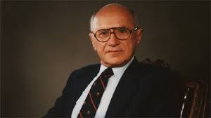

# Introduksjon

## Tre hovedtemaer: 
- Svingninger (del I)
- Økonomisk vekst (del II) 
- Økonomiske kriser (del III)

```{r include=FALSE}
library(MakroOEKB1115)
library(dplyr)
library(ggplot2)
library(gridExtra)
library(grid)

moltmacrousa <- MakroOEKB1115::moltmacrousa

# gpmakro <- function(data=moltmacrousa, variables = c('lngdp', 'hptrend'), katv = c('gdp'), startp="929-04-01", endp =" 2017-12-12", labt = list(x=NULL, y=NULL)){
#   datainp <- dplyr::filter(data, variable %in% variables, kat %in% katv, date >= startp & date <= endp)
#   ggplot(data = datainp, aes(date, value)) + geom_line() + theme_classic() +
#   geom_smooth(method = 'loess', color = 'red', size = 0.5, se = FALSE) +
#   labs(x = labt$x, y = labt$y)
# }

hpu <- gpmakro(moltmacrousa, variables = c('lngdp', 'hptrendu'), katv = c('unem')
, startp = "1929-04-01", endp =" 2017-12-12", labt = list(y='Ledighetsrate', x = 'År'))
gdu <- gpmakro(moltmacrousa, variables = c('lngdp', 'hptrendu'), katv = c('unem')
, startp = "1929-04-01", endp =" 1941-01-01", labt = list(y='Ledighetsrate', x = 'År'))
gru <- gpmakro(moltmacrousa, variables = c('lngdp', 'hptrendu'), katv = c('unem')
, startp = "2007-01-01", endp =" 2017-12-12", labt = list(y='Ledighetsrate', x = 'År'))
mpu <- gpmakro(moltmacrousa, variables = c('lngdp', 'hptrendu'), katv = c('unem')
,startp = "1945-01-01", endp =" 2007-01-01", labt = list(y='Ledighetsrate', x = 'År'))


hpg <- gpmakro(moltmacrousa, variables = c('lngdp', 'hptrendg'), katv = c('gdp'), startp = "1929-04-01", endp =" 2017-12-12", labt = list(y='BNP realpriser (log)', x = 'År'))
gdg <- gpmakro(moltmacrousa, variables = c('lngdp', 'hptrendg'), katv = c('gdp'), startp = "1929-04-01", endp =" 1941-01-01", labt = list(y='BNP realpriser (log)', x = 'År'))
grg <- gpmakro(moltmacrousa, variables = c('lngdp', 'hptrendg'), katv = c('gdp'), startp = "2007-01-01", endp =" 2017-12-12", labt = list(y='BNP realpriser (log)', x = 'År'))
mpg <- gpmakro(moltmacrousa, variables = c('lngdp', 'hptrendg'), katv = c('gdp'), startp = "1945-01-01", endp =" 2017-12-12", labt = list(y='BNP realpriser (log)', x = 'År'))
```

### USA fra 1929-2017

```{r echo=FALSE, message=FALSE, warning=FALSE, paged.print=FALSE}
grid.arrange(hpu, hpg, ncol = 2, top = 'USA' )
```

### USA fra den 2. verdenskrig og til den store resesjonsen (1946-2007) 

```{r echo=FALSE}
grid.arrange(mpu, mpg, ncol = 2, top = 'USA' )
```


### USA under dene store depresjonen (1929-1939) og resesjonen (2007-2012)

```{r echo=FALSE}
grid.arrange(gdu, gru, gdg, grg,top = 'USA' )
```


## Tre grunnleggende spørsmål forsøkt besvart
Hva forårsaker
- konjunktursvingninger?
- økonomisk vekst?
- økonomiske kriser?

## Hvilken rolle bør offentlige myndigheter spille?
- Stabiliseringspolitikk (aktiv/passiv)
- Vekstpolitikk (kapitalisme/offentlig sektor)
- Økonomiske kriser (stabiliserende/likvidierende)

## Kjente makroøkonomer
<figure>

<figcaption>John M. Keynes (1883-1946)</figcaption>
<figure>
<figure>

<figcaption>Paul Krugman(1953-)</figcaption>

<figcaption>Hyman Minsky (1919-1996)</figcaption>
<figure>
<figure>

<figcaption>Milton Friedman (1912-2006)</figcaption>

<figcaption>Friedrich Hayek (1899-1992)</figcaption>
<figure>

### Politikkanbefalinger
```{r pol, child = 'tabeller/polanbefalinger.html'}

```

## Abstraksjon 
[Ockhams barberkniv](https://no.wikipedia.org/wiki/Ockhams_barberkniv)

> More things should not be used than are necessary (*Entia non sunt multiplicanda praeter necessitatem*).

Prinsippet slår fast at man skal ikke anta flere foreteelser eller ting enn hva som trengs for å forklare de observasjoner man gjør

- Bruker mattematikk

### Sentrale aktører i makroøkonomien
#### Husholdninger (del I, del II og del III)
Konsumerer og sparer

#### Bedrifter (del I, del II og del III)
Produserer og investerer

#### Finansinstitusjoner (investerings- og forretningsbanker) (del III) 

<!--
The argument that banks originate loans and thereby create money and additional demand was once a commonplace position. But in the 1950s, American Neoclassicals in particular began to push the view that banks are effectively just intermediaries between savers and investors; the view that banks were uniquely important in capitalism became a fringe view. I cover this history and the revival of the endogenous money approach by Basil Moore, Augusto Graziani and others
-->

#### Sentralbanken (del I og III)
Setter rentenivå

#### Offentlig myndigheter (del I og III) 
Finanspolitikk

### Markedene vi studerer

#### Godemarkedet (varer og tjenester) - del I, del II og del III

#### Pengemarkedet - del I, del III

#### Arbeidsmarkedet - del I, del III

#### Finansmarkeder (kapital- og lånemarkedet) - del II, III

#### Valutakursmarkedet - del I

### Størrelsen på en økonomi

#### Lukket (global økonomi) økonomi 
Påvirkes ikke av omverden
Tilnærming: USA

#### Liten åpen økonomi
Påvirkes av, men påvirker ikke selv, omverden
Tilnærming:  Norge
