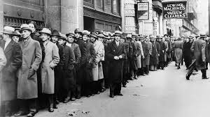

# Del 3: Økonomiske kriser



```{r eval=FALSE, include=FALSE}
# Innledning
Tre hoved temaer: (1) Svingninger, (2) økonomiske vekst og (3) dype økonomiske kriser.
To typer spørsmål blir forsøkt besvart: 
Hva forårsaker konjunktursvingninger og langsiktig vekst (positivistisk)?: 
Hvilken rolle bør offentlige myndigheter spille (normativt: stabiliseringspolitikk og vekstpolitikk)?
Sentral økonomer stiftet bekjentskap med i dette kurset:
(Marx(1818-1883)), Keynes(1883-1946)/Hicks(1904-1989)/Krugman(1953-),Friedman(1912-2006),Hayek(1899-1992)(Mises)/Minsky(1919-1996)
Aktørene i økonomien: Husholdninger, bedrifter, finansinstitusjoner, sentralbanken og offentlige myndigheter
Markedene: Vare- og tjenestemarkedet, pengemarkedet, arbeidsmarkedet, bankkreditt og valutakursmarkedet.
```

Del 3: Økonomiske kriser
Tema 1: Penger, kreditt og bankadferd
Pengens funksjoner 
	Penger som gjeld
Utvendige penger (M0(M1)): 
Skapt av sentralbanken og består av sedler, mynt pluss forretningsbankenes innskuddskontoer i sentralbanken. 

Innvendige penger(M1(M2)-M0(M1)) : 
Skapt av bankene ved at de krediterer sine innskuddskontoer.
Tre arketyper for banksystemets forskjellige utforminger 
	System 1: Lånebasert økonomi 
Problemer:
Uelastisk kredittilbud.
Kostnader ved å flytte reserver mellom forretningsbankene.

	System 2: Fraksjonsbasert bankvirksomhet uten sentralbank
Problemer:
Åpne for løp på bankene.
Kostnader ved å flytte reserver mellom forretningsbankene.

	System 3: Fraksjonsbasert bankvirksomhet med sentralbank og fiat penger
Problemer:
Systemrisiko.
Vilkårlig omfordeling av formue.
Banker og systemrisiko  
	Bloos rule: Innskuddsgaranti gjør det mer lønnsomt å velge prosjekter med unødvendig 
Dersom alle banker går får en slik løsning  Systemrisiko.
	Høyere egenkapitalkrav til bankene vil føre (1)Lavere forventede utbetalinger ved systemrisiko (2) Gradvis substitusjon over fra forretningsmodeller med overdreven risiko. 
Tema 2: Statsgjeld
Konsolidert budsjettbetingelse for offentlig sektor
Offentlig sektor
B_t^f=(1+i_(t-1) ) B_(t-1)^f+(G_t-T_t )-SNG_t    
Sentralbanken
i_(t-1) B_(t-1)^m  +∆B_t^m=∆M_t+SNG_t
Statsgjeld
B_t=B_t^f-B_t^m
	Ved å kombinere uttrykkene ovenfor får vi den konsoliderte budsjettbetingelsen for offentlig sektor

B_t=(1+i_(t-1 ) ) B_t+(G_t-T_t )-ΔM_t

Dynamikken i statsgjelden over tid
	Ved null inflasjon og  i_t=r_t og ΔM_t=0, kan uttrykket ovenfor skrives som 

B_t/Y_t =((G_t-T_t))/Y_t +  B_(t-1)/Y_(t-1) (1+r-g)
	Grafisk analyse for fire tifeller:
Viktigst:  
(1+r-g)>1 og  (i) (G_t-T_t)>0  og (ii) (G_t-T_t)<0 
Mindre viktig:
 (1+r-g)<1 og  (iii) (G_t-T_t)>0  og (iv) (G_t-T_t)<0
Mulig tiltak for å forhindre en statsgjeldskrise
	Kutte i primærbudsjettet (øke T eller redusere G)
	Mislighold
	Inflasjon ( man må gjøre sentralbanken mindre uavhengig)
Tema 3: Likviditetsfellen og privat gjeld
Hva er likviditetsfellen?
	Sitasjon hvor pengepolitikken ikke lengre kan påvirke realøkonomien på en ekspansiv måte: Kortsiktig nominell rente er (nær) lik null.
	Beskrevet først av Keynes i “General Theory” på 1930-tallet. Men blitt aktualisert etter den globale finanskrisen

Hvordan havner man i en likviditetsfelle?
	Case 1: Demografiske endringer (Krugman, 1998) ⇒Δ ̅C<0 (eks. spare mere til alderdommen)

ΔY=1/((1-c(1-t)) (Δ ̅C)<0
Likviditetsfelle dersom rentereduksjonen ikke klarer å veie opp for nedgangen i konsumet som er en følge av de demografiske endringene: 
(Δ C ̅-b∙Δ i^0)<0
⇒ΔY=1/((1-c(1-t))(Δ C ̅-b∙Δ i^0)<0


	Case 2: Privat gjeldsreduksjon (Krugman og EggertsSon, 2012)⇒ΔD^b<0 (Minsky moment)


ΔY=1/((1-¯c(1-t)) (θ∙Δ ̅D^b )<0
Likviditetsfelle dersom rentereduksjonen ikke klarer å veie opp for nedgangen i konsumet som er en følge av gjeldsreduksjonen:
 (θ∙Δ D^b-¯b  ∙Δ i^0)<0
⇒ΔY=1/((1-¯c  (1-t))(θ∙Δ D^b-b∙Δ i^0)<0

	Likviditetsfelle  Y<Y^n T=tY   går ned. Redusert BNP og redusert skatter  B_t/Y_t øker. Gitt at sentralbanken ikke gis muligheten til å øke pengemengden for å kjøpe statsobligasjoner, vil en overgang til en likviditetsfelle lett kunne smitte over i en statsgjeldskrise.  
Hvordan komme ut av en likviditetsfelle?
	Den lukkede økonomi modellen forteller oss at finanspolitikken kan betraktes som en gratis lunsj:
	Vil kunne lukke produksjonsgapet.
	Vil stabilisere prisene
	Rentekostnader ved å gjøre dette vil være (tilnærmet) lik null. 
	For en åpen økonomi er ikke situasjonen like enkel.  Dette vil bli forklart nærmere under forelesningen om krisen i eurosonen. 
