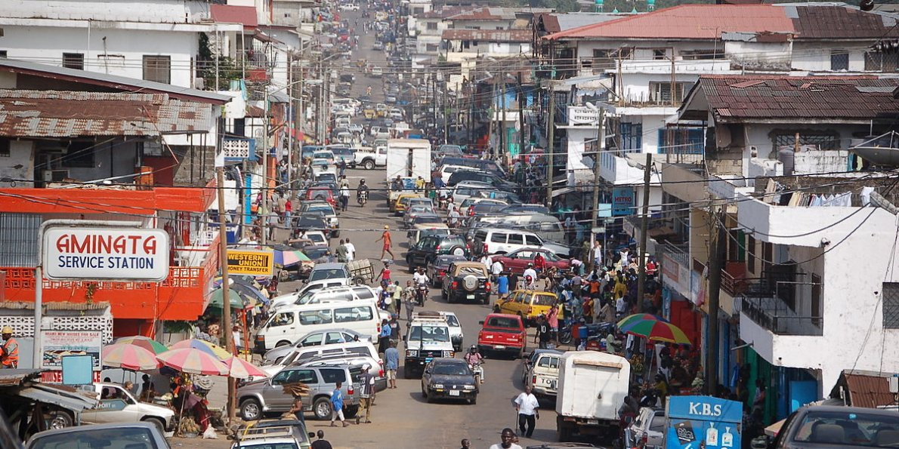

```{r eval=FALSE, include=FALSE}
# Fødselstall økonomer 
# Læringsmål
```

---
title: ''
output: pdf_document
---

### Del I: Kortsiktige konjunktursvingninger


### Del II: Langsiktig økonomisk vekst



### Del III: Økonomiske kriser


[Kursbeskrivelse](https://www.hvl.no/studier/studieprogram/emne/%C3%B8kb1115)

<span style="color:red"> Status: Under utvikling </span>

Siste gang oppdatert ``r base::Sys.time()`` av jorn.inge.halvorsen@hvl.no. 

```{r eval=FALSE, include=FALSE}
gitinfo <- list(base::system('git log --oneline', intern=TRUE),base::system('git rev-list --count HEAD', intern=TRUE))
#devtools::use_data(gitinfo, overwrite = TRUE)
print(gitinfo)
```

```{r eval=FALSE, include=FALSE}
 rmarkdown::render("index.Rmd", rmarkdown::pdf_document())
```
